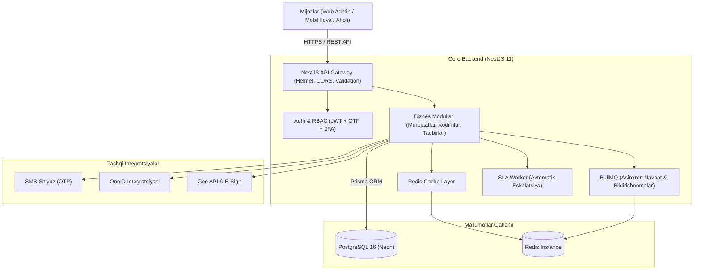

<div align="center">

# 🏛️ Mahalla Yettiligi Backend API

[](https://github.com/Lazizdeveloper/Mahalla_yettiligi_backend/actions)


**Mahalla Yettiligi boshqaruv va monitoring platformasi uchun ishlab chiqilgan kengaytiriluvchan (scalable), xavfsiz va yuqori yuklamalarga chidamli backend tizimi.**

[Arxitektura](#-tizim-arxitekturasi) • [Asosiy Imkoniyatlar](#-asosiy-imkoniyatlar) • [Tezkor Ishga Tushirish](#-tezkor-ishga-tushirish-quickstart) • [API Hujjatlari](#-api-va-modullar) • [Xavfsizlik](#-xavfsizlik-va-ishonchlilik) • [Testlash](#-testlash-va-sifat-nazorati)

</div>

---

## 🏛️ Loyiha Haqida

Ushbu backend tizimi mahalla tizimidagi 7 ta mas'ul xodim ("Mahalla Yettiligi") faoliyatini avtomatlashtirish, aholi murojaatlarini (shikoyat va takliflar) qabul qilish, ularni SLA (xizmat ko'rsatish darajasi) asosida nazorat qilish, xodimlar ishini monitoring qilish va analitik hisobotlarni shakllantirish uchun xizmat qiladi.

---

## 📐 Tizim Arxitekturasi

Tizim modulli (Modular Architecture) va Clean Architecture tamoyillari asosida qurilgan:



---

## ✨ Asosiy Imkoniyatlar

- 🔐 **Ko'p bosqichli autentifikatsiya:** Aholi, Mahalla xodimlari va Super Adminlar uchun alohida ro'yxatdan o'tish, SMS-OTP orqali kirish va maxsus rollar uchun majburiy **2FA**.
- 🛡️ **Role-Based Access Control (RBAC):** Har bir xodim (`YETTI_YOSHLAR`, `YETTI_XOTIN_QIZLAR`, `YETTI_PROFILAKTIKA` va b.) uchun alohida ruxsatnomalar.
- ⚡ **SLA va Murojaatlar monitoringi:** Murojaat belgilangan vaqt ichida ko'rib chiqilmasa, tizim avtomatik tarzda yuqori turuvchi organga eskalatsiya qiladi (har 5 daqiqada cron-job orqali).
- ⏱️ **Kesh va Asinxron navbat:** Redis yordamida tez-tez so'raladigan ma'lumotlar keshi va BullMQ orqali og'ir fon vazifalarini kechiktirmasdan bajarish.
- 📍 **Work Tracking (Xodimlar nazorati):** Mas'ul xodimlarning geolokatsiya va check-in / check-out vaqtlarini nazorat qilish.
- 📊 **Audit Logs & Analytics:** Tizimdagi har bir o'zgarish va qarorlar uchun to'liq audit jurnali.

---

## 🚀 Tezkor Ishga Tushirish (Quickstart)

### Variant 1: Docker Compose bilan (Tavsiya etiladi - 1 daqiqa)

Barcha kerakli qismlar (PostgreSQL, Redis va Backend API) avtomatik ishga tushadi:

```bash
# 1. Repozitoriyani klonlash
git clone https://github.com/Lazizdeveloper/Mahalla_yettiligi_backend.git
cd Mahalla_yettiligi_backend

# 2. Docker containerlarni ko'tarish
docker compose up -d
```

API: `http://localhost:4000/api/v1`  
Swagger hujjatlari: `http://localhost:4000/docs`

---

### Variant 2: Lokal muhitda ishga tushirish

```bash
# 1. Bog'liqliklarni o'rnatish
npm install

# 2. Muhit o'zgaruvchilarini nusxalash
cp .env.example .env

# 3. Prisma clientni yaratish va migratsiyalarni yurgizish
npm run prisma:generate
npm run prisma:migrate:dev

# 4. (Ixtiyoriy) Boshlang'ich test ma'lumotlarini yuklash (Seed)
npm run prisma:seed

# 5. Dasturni dev rejimda yoqish
npm run start:dev
```

---

## 📖 API va Modullar

Tizimda barcha API endpointlar to'liq **Swagger UI** bilan hujjatlashtirilgan:

* **Swagger UI:** `http://localhost:4000/docs`
* **Salomatlik tekshiruvi (Health):** `GET /api/v1/health/readiness` (DB, Redis, Worker holati)

| Modul | Asosiy yo'nalishlar (Endpoints) | Tavsif |
| :--- | :--- | :--- |
| **Auth** | `/auth/*/login/otp/request`, `/verify`, `/refresh` | SMS-OTP va JWT orqali ko'p darajali autentifikatsiya |
| **Complaints** | `/complaints`, `/complaints/:id/status` | Murojaatlarni qabul qilish va SLA bo'yicha yuritish |
| **Work Tracking**| `/work-tracking/check-in`, `/check-out` | Xodimlarning ish vaqti va lokatsiyasini qayd etish |
| **Dashboard** | `/dashboard/analytics`, `/dashboard/stats` | Hudud bo'yicha jonli statistika va metrikalar |
| **Audit Logs** | `/audit` | Tizim amallari tarixi va xavfsizlik nazorati |
| **Reports** | `/reports/monthly` | Oylik va choraklik hisobotlarni generatsiya qilish |

---

## 🔒 Xavfsizlik va Ishonchlilik

- **JWT Token Lifecycle:** Token rotation va qora ro'yxat (revocation) orqali seanslarni xavfsiz boshqarish.
- **Brute-force himoyasi:** OTP so'rash va tekshirishda tezlikni cheklovchi (Rate Limiting) mexanizm.
- **HTTP Himoyasi:** `helmet` yordamida xavfsizlik sarlavhalari (security headers) va qat'iy CORS filtri.
- **Yagona xatoliklar standarti:** Barcha xatolar unikal `requestId` va xavfsiz JSON tuzilmasida qaytadi.

---

## 🧪 Testlash va Sifat Nazorati

Loyihada kod sifati qat'iy avtomatlashtirilgan testlar orqali tekshiriladi:

```bash
# Unit testlar va qamrov (Coverage)
npm run test:cov

# End-to-End (E2E) testlar
npm run test:e2e

# Postman / Newman to'liq integratsion testlar
npm run test:newman

# k6 orqali yuqori yuklama (Stress / Performance) testi
npm run perf:k6:baseline
```

---

## 🔄 CI/CD Avtomatlashtirish

Loyihada **GitHub Actions** CI pipeline sozlangan. Har bir `push` va `pull_request`da quyidagi tekshiruvlar avtomat ravishda o'tadi:
1. Kod uslubi tekshiruvi (`eslint`);
2. Unit va E2E testlar (Postgres 16 va Redis 7 konteynerlarida);
3. Prisma migratsiyalari va database seed;
4. To'liq build va jonli healthcheck testi;
5. Newman regressiya testlar to'plami.

---

## 👨‍💻 Muallif

* **Laziz Shakarov** ([@Lazizdeveloper](https://github.com/Lazizdeveloper))  
* Telegram: [@Laziz_Shakarov](https://t.me/Laziz_Shakarov)  
* Email: [shakarovlaziz243@gmail.com](mailto:shakarovlaziz243@gmail.com)
